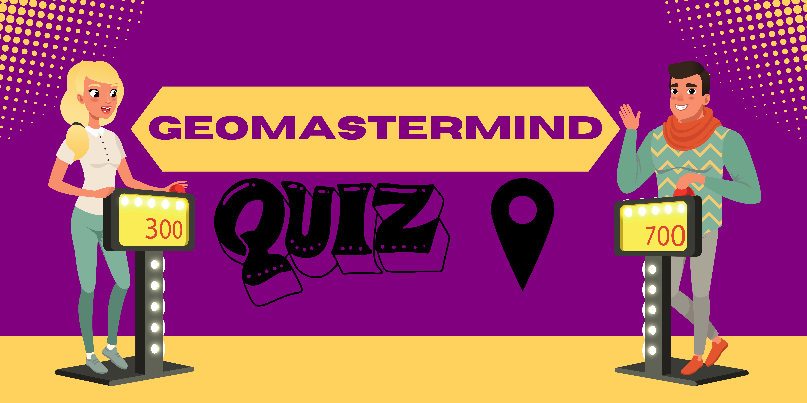
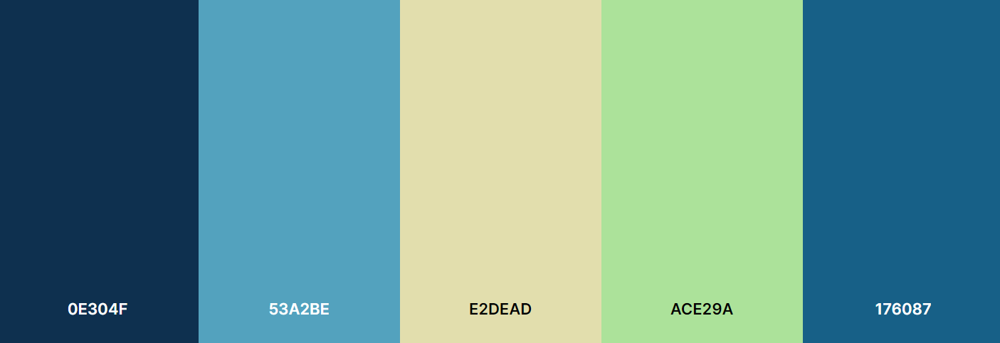

# geoMastermind 🔵

<b>Visit the deployed site:</b> [geoMastermind](https://kimbergstroem.github.io/PP2/)

Get ready to put your geography skills to the test with GeoMastermind! 

This exciting mini game, built with <b>JavaScript</b> as base and <b>HTML/CSS</b>, challenges you to answer ten questions about locations, landmarks, cultures, and more from around the world. 

With different levels of difficulty, you can compete against yourself or challenge your friends to see who can achieve the highest score. With its fun and engaging gameplay, <b>GeoMastermind</b> is the perfect way to learn more about the world and test your knowledge. Are you ready to become a <b>geoMastermind</b>?

---

## CONTENTS 🔵

* [User Experience](#user-experience-ux)
  * [User Stories](#user-stories)

* [Design](#design)
  * [Colour Scheme](#colour-scheme)
  * [Typography](#typography)
  * [Imagery](#imagery)
  * [Wireframes](#wireframes)

* [Features](#features)
  * [General Features on Each Page](#general-features-on-each-page)
  * [Future Implementations](#future-implementations)
  * [Accessibility](#accessibility)

* [Technologies Used](#technologies-used)
  * [Languages Used](#languages-used)
  * [Frameworks, Libraries & Programs Used](#frameworks-libraries--programs-used)

* [Deployment & Local Development](#deployment--local-development)
  * [Deployment](#deployment)
  * [Local Development](#local-development)
    * [How to Fork](#how-to-fork)
    * [How to Clone](#how-to-clone)

* [Testing](#testing)
  * [Solved Bugs](#Bugs)
  * [Known Bugs](#Bugs)

* [Credits](#credits)
  * [Code Used](#code-used)
  * [Content](#content)
  * [Media](#media)
  * [Acknowledgments](#acknowledgments)

---

## User Experience (UX) 🔵

### User Stories 🔹

#### First Time Visitor Goals

* As a user, I want to understand the game just by looking at it, so I can play without needing additional information.
* As a user, I want clear instructions on how to play the game effectively.
* As a user, I want to receive confirmation if my answer is correct, allowing me to increase my score and perform well.
* As a user, I want to see the remaining time while playing, so I don't run out of time.
* As a user, I want to view my final score to assess my proficiency in JavaScript or Python syntax.

#### Returning Visitor Goals

* As a user, I want different questions each time I play to test my knowledge even further.
* As a user, I want the option to play again to improve my previous score.

(<a href="#readme-top">back to top</a>)

--- 

## Design 🔵

### Colour Scheme 🔹

We wanted to choose colours that reflected the environment of the universum, so we have chosen a variety of Blue(<b>water</b>), Green(<b>nature</b>) and Yellow(<b>sun</b>) for our site.

This colors are going to be implemented as <b>60-30-10</b> rule with the base of the color #0E304F. We want to have a more dark theme on the website, along with the light colors.

The colour palette was created using the [Coolors website](https://coolors.co/aeffd8-8affc1-8fdc97-ac8887-9f4a54).

### Typography 🔹

Google Fonts was used for the following fonts:

* "Lato" is used for headings and bigger content on the site. It is a sans serif typeface family.

* "Nunito" is used for the body text, paragraphs which are the questions and answer. Nunito is a sans-serif typeface designed by Vernon Adams. It has a rounded, friendly and modern style, and its letterforms are clean and legible.

### Imagery 🔹

All the images displayed in this site was originelly downloaded by the sites below mentioned in Credit, Media section, and modified by me in Photoshop.

### Wireframes 🔹

Wireframes were created for mobile and desktop. I used the webbapplication called [Balsamiq](https://balsamiq.cloud/suu74na/psiivfn/r6B57) for creating the wireframes for webbapplication <b>geoMastermind</b>.

Click on the links below to see an large seperated image of each page.

* [Home Page](assets/readme/wireframes/wireframeIndex.png)

* [HighScore Page](assets/readme/wireframes/wireframeHighscore.png)

* [Game Page](assets/readme/wireframes/wireframeGame.png)

* [Mobile Version Design](assets/readme/wireframes/wireframeMobile.png)

(<a href="#readme-top">back to top</a>)

--- 

## Features 🔵

### Accessibility 🔹

I have been mindful during coding to ensure that the website is as accessible friendly as possible. I have achieved this by:

* Using semantic HTML elements as, header(), section(), nav().
* Declare the Language in the beginning of every html page.
* Using descriptive ALT attributes on images and links on the site.
* Using a hover state on all buttons on the site to make it clear to the user if they are hovering over a button or not.
* Providing information for screen readers where there are icons used and no text.
* Ensuring that there is a sufficient colour contrast throughout the site.
* Ensuring menus are accessible by marking the current page as current for screen readers.

(<a href="#readme-top">back to top</a>)

--- 

## Technologies Used 🔵

### Languages Used 🔹

Hyper Text Markup Language (<b>HTML</b>), Cascading Style Sheets (<b>CSS</b>) and Javascript (<b>JS</b>) were used to create this website.

### Frameworks, Libraries & Programs Used 🔹

* [Balsamiq](https://balsamiq.cloud/) - Used to create wireframes.

* [Git](https://git-scm.com/) - For version control. Which my profiles hours was ended and i needed to upload the last commits by github, therfore my commit message and description isnt good enough at the end.

* [Github](https://www.github.com/) - To save and store the files for the website.

* [Google Fonts](https://fonts.google.com/) - To import the fonts used on the website.

* [Font Awesome](https://fontawesome.com/) - For the iconography on the website.

* [Google fonts](https://fonts.google.com/) - To troubleshoot and test features, solve issues with responsiveness and styling.

* [Tiny PNG](https://tinypng.com/) To compress images.

* [Birme](https://www.birme.net/) - To change format of image to webp format.

* [Favicon.io](https://favicon.io/) To create favicon.

* [Am I Responsive?](http://ami.responsivedesign.is/) To show the website image on a range of devices.

* [Shields.io](https://shields.io/) To add badges to the README

(<a href="#readme-top">back to top</a>)

--- 

## Deployment & Local Development 🔵

Github Pages was used to deploy the live website. The instructions to achieve this are below:

1. Log in (or sign up) to Github.com.
2. Find the repository for this project, "PP2".
3. Click on the Settings link.
4. Click on the Pages link in the left hand side navigation bar.
5. In the Source section, choose main from the drop down select branch menu. Select Root from the drop down select folder menu.
6. Click Save. Your live Github Pages site is now deployed at the URL shown.

### Local Development 🔹

#### How to Fork

To fork the PP1 repository:

1. Log in (or sign up) to Github.
2. Go to the repository for this project, https://github.com/KimBergstroem/PP2.
3. Click the Fork button in the top right corner.

#### How to Clone

To clone the PP1 repository:

1. Log in (or sign up) to GitHub.
2. Go to the repository for this project, https://github.com/KimBergstroem/PP2.
3. Click on the code button, select whether you would like to clone with HTTPS, SSH or GitHub CLI and copy the link shown.
4. Open the terminal in your code editor and change the current working directory to the location you want to use for the cloned directory.
5. Type 'git clone' into the terminal and then paste the link you copied in step 3. Press enter.

(<a href="#readme-top">back to top</a>)

--- 

## Testing 🔵

All testing was carried out in [Testing.md](TESTING.md). 

### Solved Bugs 🔹
| Type   | Bug                                                                                                                                                                                                                                                                                                                                           | Solution                                                                                                                                                                                                                                                                                                                                                                    |
|--------|------------------------------------------------------------------------------------------------------------------------------------------------------------------------------------------------------------------------------------------------------------------------------------------------------------------------------------------------|--------------------------------------------------------------------------------------------------------------------------------------------------------------------------------------------------------------------------------------------------------------------------------------------------------------------------------------------------------------------------|
| Script.js | Couldn't get my images right in the array that would be displayed in every question. | Solution was the root and also change to display with tring html "image.innerHTML = currentQuestion.image; - image.classList.add("quiz-image");" |
| Script.js | When clicking on a question, even if it was right or not, user had chance to click on other questions as well. | Added: "button.disabled = true;" so when the user has clicked or answered, the other buttons will be disabled. |  
| Script.js | The "Next button" was showing all the time while the question was displayed and the button can easily be clicked by mistake and enter next question without any answer or score of user. | Hide the button until the answer is answered or once one button is clicked, then the "Next button" will show for entering next question. | 
Script.js | How to stop the timer when a user clicked on the answer button | Just added the "clearInterval(counter);" in my selectAnswer function. clearInterval was learned here [wc3](https://www.w3schools.com/jsref/met_win_clearinterval.asp). |                                                                                                                                                                                       

### Known Bugs 🔹
| Type   | Bug                                                                                                                                                                                                                                                                                                                                           | Solution                                                                                                                                                                                                                                                                                                                                                                    |
|--------|------------------------------------------------------------------------------------------------------------------------------------------------------------------------------------------------------------------------------------------------------------------------------------------------------------------------------------------------|--------------------------------------------------------------------------------------------------------------------------------------------------------------------------------------------------------------------------------------------------------------------------------------------------------------------------------------------------------------------------|
| Script.js | When the last question is answered, the last picture is still displaying, when only the scoreboard should be displaying. | Still a bugg | 
| Script.js | If you click refresh on the browser while playing your game, you are going back to the main menu and the game is turned off. | Still a bugg |                                                                                                                                                         |
 

(<a href="#readme-top">back to top</a>)

--- 

## Credits 🔵

### Code Used 🔹

I used this YouTube channels [Kevin Powell](https://www.youtube.com/@KevinPowell) , [CodingNepal](https://www.youtube.com/@CodingNepal) , [Easy Tutorials](https://www.youtube.com/@EasyTutorials)

Learnt how to stop countdown here [W3 Schools](https://www.w3schools.com/jsref/met_win_clearinterval.asp)

Small code snippets and how to create different type of elements [W3 Schools](https://www.w3schools.com/css/css_form.asp)

### Content 🔹

Paragraphs / text for the webpage/readme was written together with [ChatGPT](https://chat.openai.com/)

Tips and inspiration on how to create a better readme.md file [kera-cudmore powerpoint](https://docs.google.com/presentation/d/19_7r_To5bu7UjnZD87hrzWQi63Ij0YpaRH1XFnPZZe8/edit#slide=id.g35f391192_00)

###  Media 🔹

The photos used throughout the quiz is coming from [Canvas Pro](https://unsplash.com/).

The background image on the front page is created by me and the program used are [Canvas Pro](https://unsplash.com/).
  
###  Acknowledgments 🔹

I'd like to give recognition to the individuals who supported me in finishing this project:

* I'd like to express my appreciation to my family for their patience and helping me spot spell mistakes and testing issues.
* [Jubril](https://github.com/jubril), my Code Institute Mentor.

(<a href="#readme-top">back to top</a>)

--- 

